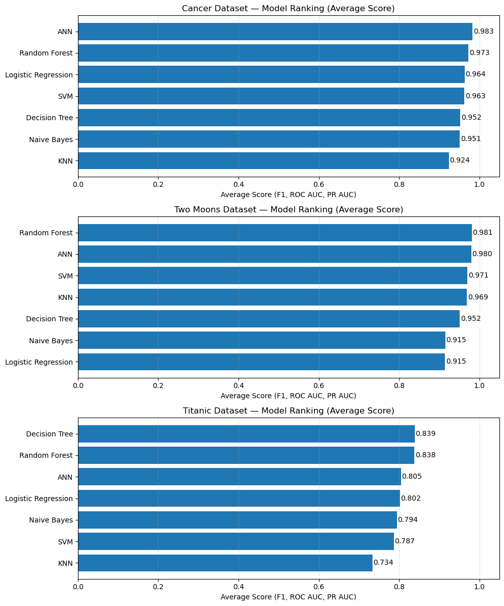

# Classification From Scratch
A hands-on machine learning project building classification models from scratch and comparing them on multiple datasets with visual analyses.

## Project Overview
This repository explores how different classifiers learn decision boundaries, handle feature relationships, and perform under different data conditions. The goal is to build intuition, not only report metrics.

The project includes:
* Implementation of multiple models from scratch, using only Pandas / Numpy
* Comparison across three datasets with different characteristics
* Confusion matrices, ROC curves, and Precision-Recall curves
* Decision boundary visualization on the Two Moons dataset
* Custom visualizations to understand model behavior

## Datasets
### 1. Breast Cancer Dataset
A structured binary classification dataset used to compare model performance on real tabular medical data.

**Purpose:**
* Evaluate classical classifiers on a common benchmark

### 2. Titanic Dataset
A real-world dataset with mixed feature types and missing values.

**Purpose:**
* Test how models handle messy, practical data

### 3. Two Moons Dataset
A synthetic nonlinear dataset used to visualize decision boundaries.

**Purpose:**
* Show which models can learn nonlinear separations

## Models Implemented
The following models were implemented and compared:
* Naive Bayes (NB)
* K-Nearest Neighbors (KNN)
* Decision Tree
* Random Forest
* Logistic Regression
* Artificial Neural Network (ANN)
* Support Vector Machine (SVM)

## What Each Model Contributes
* **Naive Bayes:** Fast probabilistic baseline with strong independence assumptions
* **KNN:** Instance-based learner that predicts using nearby samples
* **Decision Tree:** Rule-based model that splits the feature space recursively
* **Random Forest:** Ensemble of trees that reduces overfitting through averaging
* **Logistic Regression:** Linear classifier with probabilistic output
* **ANN:** Flexible nonlinear model trained through backpropagation
* **SVM:** Margin-based classifier that can model nonlinear boundaries with kernels

## Experiments and Visualizations

### 1. Confusion Matrices
Confusion matrices were generated for every model and dataset to inspect class-wise mistakes.

### 2. ROC Curves
ROC curves were used to compare threshold-based performance.

### 3. Precision-Recall Curves
Precision-Recall curves were included to better evaluate performance on class imbalance.

### 4. Decision Boundaries on Two Moons
Decision boundaries were plotted for all models on the Two Moons dataset to show how each classifier separates nonlinear data.

### 5. KNN Neighborhood Visualization
For KNN on the Two Moons dataset, the neighborhood of a random test point was visualized to show which training samples influence the prediction.

### 6. Tree Visualizations
Decision Tree and Random Forest structures were visualized to show how split-based models make predictions.

### 7. Loss Curves
For Logistic Regression and ANN, loss over epochs was plotted to show the learning process.

### 8. Feature Importance
For logistic regression, feature coefficients were visualized to show 
which features contribute most to predictions.

### 9. ANN Activations
For the ANN, activations from all layers were visualized for a random test sample to show how the network processes information.

### 10. SVM Support Vectors
For SVM on the Two Moons dataset, support vectors were highlighted in the decision boundary plot to show which samples are critical.

## Results Summary
This project highlights how different algorithms behave under different assumptions:

* Linear models work best when the boundary is linear, but struggle with nonlinear data
* Logistic Regression performs better when multicollinearity is treated
* Tree-based models handle nonlinear interactions well
* Random Forest can improve stability but can be outperformed by a decision tree on small datasets due to averaging
* KNN can model complex shapes but may be sensitive to local noise
* Naive Bayes is simple and fast, but its assumptions of feature independence can limit performance
* ANN and SVM can model more complex patterns, depending on dataset size, tuning and preprocessing

### Usage
1. Clone the repository
2. Run the notebooks
3. Play with the hyperparameters and visualizations

**Author**: Daniel Pederzini  
**Purpose**: Machine Learning Educational Project
